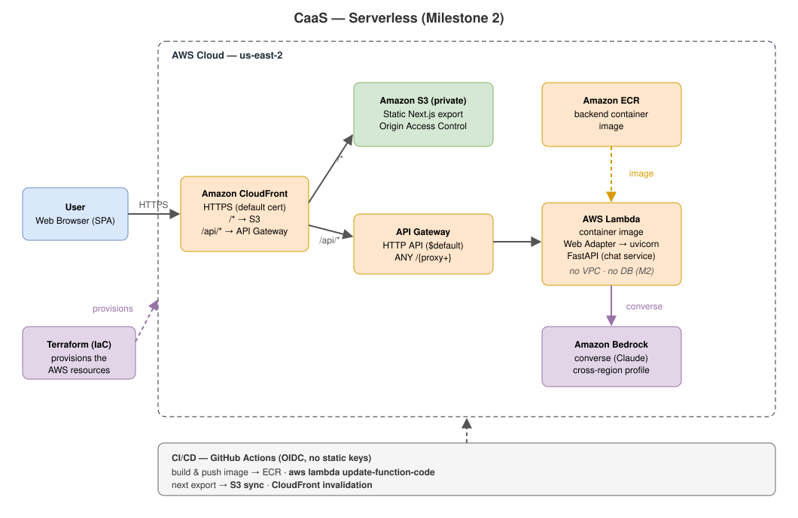

# Nimbus — Chatbot-as-a-Service (CaaS)

[](https://github.com/malikfahadsaeed/CaaS/actions/workflows/ci.yml)

A cloud-native **Chatbot-as-a-Service** platform: a customizable chat interface
backed by a FastAPI service, fully containerized and deployed to AWS over HTTPS.

This repository is the **foundation release** — a complete, production-shaped
slice (frontend, API, TLS, infrastructure-as-code, CI/CD) built so richer
capabilities (real LLM responses, authentication, persistence, multi-tenancy)
can be added without re-architecting. The backend currently returns a fixed
assistant greeting; the service layer is the single seam where an LLM plugs in.

## Features

- 💬 **Customizable chat UI** — responsive Next.js + Tailwind interface, light/dark
  aware, fully re-brandable from a single theme file.
- ⚡ **FastAPI backend** — clean layered architecture (routes → services), typed,
  with a consistent response envelope and unit tests.
- 🔒 **HTTPS out of the box** — Caddy reverse proxy with automatic, auto-renewing
  Let's Encrypt certificates.
- ☁️ **Infrastructure as code** — one `terraform apply` provisions the full AWS
  stack (VPC, EC2, Elastic IP, security group).
- 🚀 **CI/CD** — GitHub Actions lints, type-checks, tests, and publishes container
  images to GitHub Container Registry.
- 🐳 **Container-first** — a single `docker compose up` runs the whole stack locally.

## Architecture



*Editable source: [docs/architecture.drawio](docs/architecture.drawio) — open at
[app.diagrams.net](https://app.diagrams.net) or with the VS Code Draw.io extension.
Re-export to `docs/architecture.svg` after edits.*

## Tech stack

| Layer | Technology |
| --- | --- |
| Frontend | Next.js (App Router), TypeScript, Tailwind CSS |
| Backend | Python 3.12, FastAPI, Pydantic, uv |
| Reverse proxy / TLS | Caddy + Let's Encrypt |
| Infrastructure | AWS (EC2, VPC, Elastic IP), Terraform |
| CI/CD | GitHub Actions, GitHub Container Registry (ghcr.io) |
| Runtime | Docker, Docker Compose |

## Project structure

```
.
├── backend/                # FastAPI service (routes → services), tests
├── frontend/               # Next.js chat UI (components, theme, API client)
├── infra/
│   ├── Caddyfile           # reverse-proxy + TLS config
│   ├── docker-compose.prod.yml
│   └── terraform/          # AWS infrastructure
├── docker-compose.yml      # local development stack
├── docs/architecture.drawio
└── .github/workflows/ci.yml
```

## Getting started (local)

Run the entire stack behind Caddy:

```bash
docker compose up --build
# open http://localhost
```

Or run each service directly for development:

```bash
# Backend → http://localhost:8090
cd backend
cp env.example .env
uv run uvicorn app.main:app --reload --port 8090

# Frontend → http://localhost:3000
cd frontend
cp env.example .env.local     # set NEXT_PUBLIC_API_BASE_URL=http://localhost:8090/api/v1
npm install
npm run dev
```

## Testing & quality

```bash
# Backend
cd backend
uv run ruff check .      # lint
uv run mypy app          # types
uv run pytest -q         # tests

# Frontend
cd frontend
npm run lint
npm run typecheck
npm run build
```

## Deployment (AWS)

**Prerequisites:** an AWS account with credentials configured (`aws configure`),
Terraform ≥ 1.5, an SSH key pair, a domain (a free [DuckDNS](https://www.duckdns.org)
subdomain works), and the container images published to ghcr.io.

1. **Publish images** — merging to `main` triggers CI to build and push
   `caas-backend` and `caas-frontend` to ghcr.io. Set both packages to **public**
   so the instance can pull them without authentication.
2. **Configure** — copy the example vars and fill them in (kept local; never
   committed):
   ```bash
   cd infra/terraform
   cp terraform.tfvars.example terraform.tfvars   # domain, your IP/32, ghcr owner, key path
   ```
3. **Provision** — Terraform creates the VPC, EC2 instance, security group, and a
   static Elastic IP; the instance bootstraps Docker and starts the stack:
   ```bash
   terraform init && terraform plan && terraform apply
   ```
4. **Point DNS** at the Elastic IP:
   ```bash
   curl "https://www.duckdns.org/update?domains=<subdomain>&token=<token>&ip=$(terraform output -raw public_ip)"
   ```

Caddy issues the Let's Encrypt certificate automatically on the first HTTPS
request. Browse to `https://<your-domain>` — done.

### Redeploy

```bash
ssh -i <key> ec2-user@<elastic-ip>
cd /opt/caas && docker compose pull && docker compose up -d
```

### Teardown

```bash
cd infra/terraform && terraform destroy
```

## Roadmap

The service layer and infrastructure are intentionally extensible. Planned next:

- Real LLM-backed responses (drop-in at the chat service layer)
- Authentication and per-tenant configuration
- Persistence (PostgreSQL + migrations)
- Remote Terraform state and a managed, horizontally scalable runtime
  (e.g. ECS Fargate + ALB)
